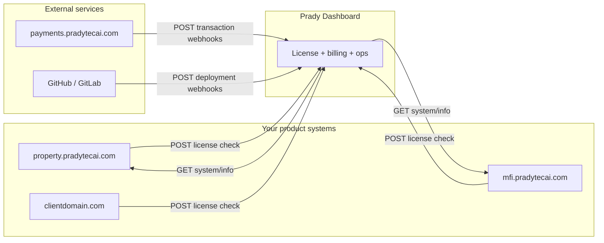

# Prady Dashboard — Integration Setup Guide

**Start-to-finish guide** for connecting Prady Dashboard (`dashboard.pradytecai.com`) to the product systems you manage (property, MFI, CRM, client domains, payments gateway, CI/CD).

> **In the dashboard UI:** open **Integration Setup Guide** in the sidebar (between HR & Team and Settings) for the interactive step-by-step module with copyable endpoints and code stubs.

> **Implementing in a product app (MFI, Property, CRM)?** Use [PRODUCT_APP_INTEGRATION_BRIEF.md](./PRODUCT_APP_INTEGRATION_BRIEF.md) + `stubs/tenant-integration/` — includes Cursor prompt, acceptance tests, and copy-paste Laravel files.

For internal architecture detail, see [CONTROL_PLANE_ARCHITECTURE.md](./CONTROL_PLANE_ARCHITECTURE.md).

---

## What you are wiring

Prady Dashboard is the **control plane**. Each product/tenant runs on its **own domain** (WHM/cPanel or similar). Communication is **server-to-server HTTP only** — no shared sessions, no cross-database queries.



| Direction | Purpose |
|-----------|---------|
| **Product → Dashboard** | License enforcement, usage heartbeat |
| **Dashboard → Product** | Health, version, usage polling |
| **Payments Gateway → Dashboard** | Transaction sync for billing |
| **CI provider → Dashboard** | Deployment pipeline triggers |

---

## Setup checklist (overview)

Use this as your end-to-end checklist. Each step is detailed in the sections below.

- [ ] **1.** Install and configure the dashboard (`.env`, database, queue worker)
- [ ] **2.** Create a **Hosted Project** (product) and copy its **API token**
- [ ] **3.** Create a **Tenant** linked to that project; note `tenant_key`, `license_secret`, `tenant_domain`
- [ ] **4.** Create a **subscription** for the tenant (enables integrations tab)
- [ ] **5.** In the **product app**: add license middleware + env vars; verify `POST /api/v1/license/check`
- [ ] **6.** In the **product app**: expose `GET /api/system/info`; configure integration in dashboard
- [ ] **7.** (Optional) Send usage heartbeat from product app
- [ ] **8.** (Optional) Link **Payments Gateway** treasury for M-Pesa billing
- [ ] **9.** (Optional) Wire **deployment webhooks** from GitHub/GitLab
- [ ] **10.** Confirm **Integration readiness** on the tenant command center

---

## Part 1 — Dashboard server setup

### 1.1 Environment variables

Copy `.env.example` to `.env`, run `php artisan key:generate`, and configure at minimum:

| Variable | Required | Purpose |
|----------|----------|---------|
| `APP_URL` | Yes | Public URL of this dashboard (e.g. `https://dashboard.pradytecai.com`) |
| `DB_*` | Yes | Database connection |
| `QUEUE_CONNECTION` | Yes | `redis` in production; `database` acceptable locally |
| `REDIS_*` | If using redis | Sessions, cache, queues |
| `PRADY_LICENSE_REQUIRE_SIGNATURE` | Recommended `true` | Require HMAC on license checks when tenant has a secret |
| `PRADY_LICENSE_CACHE_TTL` | Optional (default 600) | Documented for product apps; dashboard does not cache license responses |
| `PRADY_LICENSE_RATE_LIMIT` | Optional (default 120) | Per-minute throttle on `/api/v1/license/check` |
| `PAYMENTS_GATEWAY_URL` | For treasury | Base URL of payments.pradytecai.com |
| `PAYMENTS_GATEWAY_ADMIN_TOKEN` | For treasury | Bearer token for gateway admin API |
| `PAYMENTS_GATEWAY_WEBHOOK_SECRET` | For billing sync | Shared secret for inbound gateway webhooks |
| `DEPLOYMENTS_WEBHOOK_SECRET` | For CI/CD | Default secret when integration has no per-integration secret |
| `INTEGRATIONS_API_TIMEOUT` | Optional (default 8) | Timeout when dashboard polls tenant systems |

**Local Windows without Redis:**

```env
SESSION_DRIVER=database
QUEUE_CONNECTION=database
CACHE_STORE=database
INTEGRATIONS_FALLBACK_WITHOUT_REDIS=true
```

### 1.2 Run migrations and workers

```bash
php artisan migrate
php artisan db:seed   # if you use seeders for roles/modules
php artisan queue:work   # or Horizon in production
```

Verify the app is up: `GET {APP_URL}/up` should return healthy.

---

## Part 2 — Register a hosted product

A **Hosted Project** represents one Prady product line (e.g. Property, MFI, CRM).

### 2.1 In the dashboard UI

1. Go to **Infrastructure → Hosted Projects** (or equivalent admin route).
2. Create a project with:
   - **Name** — display name
   - **Domain** — base product domain (e.g. `property.pradytecai.com`)
   - **Product key** — stable slug used in API calls (e.g. `property`)
3. Open the project and **copy the API token** (`api_token`). This is generated automatically on create.

### 2.2 What the product app needs from this step

| Credential | Where it goes in product app |
|------------|------------------------------|
| `api_token` | `PRADY_PROJECT_API_TOKEN` |
| `product_key` | `PRADY_PRODUCT_KEY` |
| Dashboard URL | `PRADY_DASHBOARD_URL` |

**Important:** One API token identifies the **product**, not an individual tenant. All tenants on that product share the same project token; tenants are distinguished by `tenant_key`.

---

## Part 3 — Register a tenant

### 3.1 In the dashboard UI

1. Go to **Tenants → Create tenant**.
2. Set:
   - **Company name**
   - **Hosted project** — link to the product from Part 2
   - **Tenant domain** — the hostname users actually visit (e.g. `abc.property.pradytecai.com` or `clientdomain.com`)
3. After save, open the tenant record and copy:
   - **Tenant key** (`tenant_key`) — e.g. `abc-properties`
   - **License secret** (`license_secret`) — auto-generated; used for HMAC signing
   - **External key** (`external_key`) — UUID; used by usage heartbeat API

### 3.2 Create a subscription

On the tenant **command center**, create a **project subscription** (package/plan). This unlocks the **Integrations** tab for tenant-system API configuration.

### 3.3 Domain matching rules

License checks validate the `domain` field in the request:

- If `tenant_domain` is set on the tenant → must match **exactly** (case-insensitive).
- If not set → request domain must equal the hosted project domain or be a subdomain of it.

---

## Part 4 — Product app: license enforcement (inbound API)

Your product app must call the dashboard on every session (or cache the result). Sample code lives in `stubs/tenant-integration/`.

### 4.1 Copy integration files

| Stub file | Destination in product app |
|-----------|---------------------------|
| `CheckPradyLicense.php` | `app/Http/Middleware/` |
| `config-services-prady-snippet.php` | merge into `config/services.php` |
| Error views | `resources/views/errors/license-unavailable.blade.php`, `tenant-suspended.blade.php` |

Register middleware on `web` routes (and optionally `api` if you enforce licenses there).

### 4.2 Product app environment

```env
PRADY_DASHBOARD_URL=https://dashboard.pradytecai.com
PRADY_PROJECT_API_TOKEN=<hosted_project_api_token>
PRADY_PRODUCT_KEY=property
PRADY_TENANT_KEY=abc-properties
PRADY_LICENSE_SECRET=<tenant_license_secret>
PRADY_LICENSE_CACHE_TTL=600
```

### 4.3 API: `POST /api/v1/license/check`

**Authentication:** Project API token (identifies the product).

| Header | Value |
|--------|-------|
| `Authorization` | `Bearer {project_api_token}` |
| `X-Project-Token` | Alternative to Bearer |
| `X-Prady-Signature` | `HMAC-SHA256(raw_json_body, tenant.license_secret)` — **required** when secret is set |
| `X-License-Signature` | Alias for `X-Prady-Signature` |

**Request body:**

```json
{
  "tenant_key": "abc-properties",
  "product_key": "property",
  "domain": "abc.property.pradytecai.com"
}
```

**Success response (200):**

```json
{
  "allowed": true,
  "tenant_status": "active",
  "access_level": "full",
  "message": "Access granted",
  "enabled_modules": ["core", "reports"],
  "expires_at": "2026-08-01T00:00:00+03:00"
}
```

**Access levels — enforce in your product app:**

| `access_level` | `allowed` | Product behavior |
|----------------|-----------|------------------|
| `full` | `true` | Normal operation |
| `warning` | `true` | Show payment banner; allow access |
| `read_only` | `false` | Login OK; block POST/PUT/PATCH/DELETE |
| `blocked` | `false` | Block login / dashboard |

When `allowed` is `false` due to billing, the response may include a `billing` object with `amount_due`, `invoice_number`, `payment_instructions`, and `actions` (pay links).

**Error responses:**

| HTTP | Cause |
|------|-------|
| 401 | Invalid/missing project token or invalid HMAC signature |
| 403 | Product key mismatch or domain mismatch |
| 404 | Tenant not found for this hosted project |
| 429 | Rate limit exceeded (`PRADY_LICENSE_RATE_LIMIT` per minute) |

**Example (curl):**

```bash
BODY='{"tenant_key":"abc-properties","product_key":"property","domain":"abc.property.pradytecai.com"}'
SIG=$(echo -n "$BODY" | openssl dgst -sha256 -hmac "$LICENSE_SECRET" | awk '{print $2}')

curl -sS -X POST "https://dashboard.pradytecai.com/api/v1/license/check" \
  -H "Authorization: Bearer $PROJECT_API_TOKEN" \
  -H "Content-Type: application/json" \
  -H "X-Prady-Signature: $SIG" \
  -d "$BODY"
```

### 4.4 Legacy enterprise endpoint (optional)

`POST /api/license/check` — older shape using numeric `tenant_id` and `product` (product slug). Prefer `/api/v1/license/check` for new integrations.

---

## Part 5 — Product app: tenant system API (outbound from dashboard)

The dashboard **polls** your product installation to read version, usage, and health. You must expose a read endpoint and store a shared token the dashboard will send.

### 5.1 Copy integration files

| Stub file | Destination |
|-----------|-------------|
| `SystemInfoController.php` | `app/Http/Controllers/Api/` |
| `AuthenticatePradyDashboard.php` | `app/Http/Middleware/` |
| `routes-api-snippet.php` | add route to `routes/api.php` |

### 5.2 Product app environment

```env
PRADY_DASHBOARD_API_TOKEN=<generate-a-long-random-secret>
PRADY_TENANT_CODE=ABC-PROPERTIES
PRADY_PRODUCT_NAME="Prady Property"
PRADY_BUILD=100
PRADY_COMMIT=abc123def
PRADY_LAST_DEPLOYED_AT=2026-06-01T10:00:00Z
```

Use the **same** `PRADY_DASHBOARD_API_TOKEN` value when configuring the integration in the dashboard (stored encrypted as the integration API secret).

### 5.3 API: `GET /api/system/info`

**Authentication** (dashboard sends one of):

- `Authorization: Bearer {PRADY_DASHBOARD_API_TOKEN}`
- `X-API-Key: {PRADY_DASHBOARD_API_TOKEN}`

**Response contract:**

| Field | Required | Description |
|-------|----------|-------------|
| `status` | Yes | e.g. `ok` |
| `version` | Yes | Semantic version string |
| `project` | Recommended | Product display name |
| `tenant_code` | Recommended | Short tenant identifier |
| `build`, `commit` | Recommended | Build metadata |
| `environment` | Recommended | `production`, `staging`, etc. |
| `app_url` | Recommended | Canonical tenant URL |
| `last_deployed_at` | Recommended | ISO 8601 timestamp |
| `usage` | Recommended | Object with `users`, `branches`, `storage_mb`, etc. |
| `health` | Recommended | Object with `database`, `queue`, `scheduler`, `storage` — each `ok`, `degraded`, `error`, or `unknown` |

**Example response:**

```json
{
  "status": "ok",
  "project": "Prady Property",
  "tenant_code": "ABC-PROPERTIES",
  "version": "2.4.1",
  "build": "241",
  "commit": "a1b2c3d",
  "environment": "production",
  "app_url": "https://abc.property.pradytecai.com",
  "last_deployed_at": "2026-06-01T08:30:00Z",
  "usage": {
    "users": 24,
    "branches": 2,
    "storage_mb": 890
  },
  "health": {
    "database": "ok",
    "queue": "ok",
    "scheduler": "ok",
    "storage": "ok"
  }
}
```

### 5.4 Configure in the dashboard

1. Open tenant → **Integrations** tab.
2. Select the project subscription.
3. Add **Tenant system API** integration:
   - **Endpoint URL** — full URL, e.g. `https://abc.property.pradytecai.com/api/system/info`
   - **Authentication** — `Bearer token` or `API key header`
   - **API secret** — same value as `PRADY_DASHBOARD_API_TOKEN` in the product app
   - **Purpose** — `system_info` (recommended)
4. Click **Test connection** or **Pull system info**.

The dashboard polls all tenant integrations **hourly** via `PollTenantIntegrationsFleetJob`. You can also trigger manual sync from the Integrations tab.

**Authentication types supported by the dashboard client:**

| Type | Dashboard sends |
|------|-----------------|
| `none` | No auth header |
| `bearer_token` | `Authorization: Bearer {secret}` |
| `api_key_header` | `X-API-Key: {secret}` |
| `basic_auth` | Basic auth with `username:password` in secret field |

---

## Part 6 — Usage heartbeat (optional)

Product apps can push usage metrics directly instead of waiting for dashboard polling.

### API: `POST /api/v1/tenant/usage`

**Authentication:** Same project API token as license check (no HMAC required).

**Request body:**

```json
{
  "tenant_key": "550e8400-e29b-41d4-a716-446655440000",
  "active_users": 18,
  "database_size_mb": 420.5,
  "storage_usage_mb": 1200,
  "last_login_at": "2026-06-01T14:22:00Z",
  "server_cpu_percent": 12.5,
  "reported_app_version": "2.4.1"
}
```

**Note:** `tenant_key` here is the tenant's **`external_key`** (UUID), not the human-readable `tenant_key` string used in license checks.

**Response (200):**

```json
{
  "accepted": true,
  "captured_at": "2026-06-01T14:25:00+03:00"
}
```

---

## Part 7 — Payments Gateway integration

The dashboard controls **payments.pradytecai.com** but does not store M-Pesa credentials. Treasury data lives on the gateway; the dashboard links tenants and mirrors transactions for billing.

### 7.1 Dashboard environment

```env
PAYMENTS_GATEWAY_URL=https://payments.pradytecai.com
PAYMENTS_GATEWAY_ADMIN_TOKEN=<gateway_admin_bearer_token>
PAYMENTS_GATEWAY_WEBHOOK_SECRET=<shared_webhook_secret>
PAYMENTS_GATEWAY_SYNC_ENABLED=true
```

### 7.2 Link a tenant to gateway treasury

1. **Settings → API & Integrations → Payments Gateway**
2. Open **Treasury Mapping** for the dashboard tenant
3. **Link** — creates or adopts a gateway tenant using dashboard `external_key` as `external_tenant_id`
4. Configure on the gateway (via dashboard UI): payment profiles, PayBill accounts, webhook endpoints, API keys

Expected tenant listener URL for payment events:

```
https://{tenant_primary_domain}/webhooks/payments-gateway/events
```

### 7.3 Inbound webhook: `POST /api/v1/payments-gateway/webhooks`

Configure **payments.pradytecai.com** to POST transaction events to the dashboard when billing sync is needed.

**Authentication** (one of):

| Method | Header |
|--------|--------|
| Bearer token | `Authorization: Bearer {PAYMENTS_GATEWAY_WEBHOOK_SECRET}` |
| Token header | `X-Payments-Gateway-Token` or `X-Webhook-Token` |
| HMAC | `X-Payments-Gateway-Signature: sha256={hmac_of_raw_body}` |

**Request body:**

```json
{
  "event": "transaction.completed",
  "transaction": {
    "uuid": "9b2c3f4a-1e2d-4b5c-9a8b-7c6d5e4f3a2b",
    "tenant_uuid": "<payments_gateway_tenant_uuid>",
    "amount": 1500,
    "currency": "KES",
    "status": "success",
    "transaction_type": "mpesa_stk",
    "mpesa_receipt_number": "ABC123XYZ",
    "phone_number": "254712345678",
    "processed_at": "2026-06-01T12:00:00Z"
  }
}
```

The dashboard matches `transaction.tenant_uuid` to `tenants.payments_gateway_tenant_uuid` and upserts `tenant_payments`. Imports are **idempotent** on `transaction.uuid`.

**Response (200):**

```json
{
  "received": true,
  "event": "transaction.completed",
  "payment_id": 42,
  "transaction_uuid": "9b2c3f4a-1e2d-4b5c-9a8b-7c6d5e4f3a2b"
}
```

For PayBill callback URLs, go-live dry runs, and operations console detail, see [CONTROL_PLANE_ARCHITECTURE.md](./CONTROL_PLANE_ARCHITECTURE.md#payments-gateway-control-plane).

---

## Part 8 — Deployment CI webhooks (optional)

Wire GitHub, GitLab, or similar to trigger deployment processing in the dashboard.

### 8.1 Create a deployment integration

In the dashboard admin, create a **Deployment Integration** record (provider, name, settings). Per-integration `webhook_secret` in settings overrides the global `DEPLOYMENTS_WEBHOOK_SECRET`.

### 8.2 API: `POST /api/v1/deployments/webhooks/{integration_id}`

**Authentication** (one of):

| Method | Header |
|--------|--------|
| Bearer / token | `Authorization: Bearer {webhook_secret}` or `X-Deployment-Token` |
| GitHub-style HMAC | `X-Hub-Signature-256: sha256={hmac_of_raw_body}` |

**Request body:** Provider-native JSON (GitHub push hook, GitLab pipeline event, etc.). The dashboard extracts `ref`, `repository`, `action`/`event`/`object_kind` for logging.

**Response (202):**

```json
{
  "received": true,
  "event_id": 15
}
```

Processing continues asynchronously via `ProcessDeploymentWebhookJob`.

**Example (curl):**

```bash
curl -sS -X POST "https://dashboard.pradytecai.com/api/v1/deployments/webhooks/1" \
  -H "Authorization: Bearer $DEPLOYMENTS_WEBHOOK_SECRET" \
  -H "Content-Type: application/json" \
  -d '{"ref":"refs/heads/main","repository":{"full_name":"org/repo"}}'
```

---

## Part 9 — Verify the integration

### 9.1 Integration readiness (tenant command center)

The dashboard shows a readiness checklist per tenant:

| Check | Pass criteria |
|-------|---------------|
| Hosted product | Tenant linked to project with valid API token |
| License signing | `license_secret` set on tenant |
| Tenant system API | Integration configured, endpoint reachable |
| Treasury mapping | (Optional) `payments_gateway_tenant_uuid` linked |

### 9.2 Manual verification commands

```bash
# Dashboard health
curl -sS https://dashboard.pradytecai.com/up

# License check (from a machine with secrets)
# ... see Part 4.3 curl example

# Tenant system info (from dashboard network)
curl -sS -H "Authorization: Bearer $PRADY_DASHBOARD_API_TOKEN" \
  https://abc.property.pradytecai.com/api/system/info

# Ops integration health (on dashboard server)
php artisan ops:health --json
```

### 9.3 Common failures

| Symptom | Likely cause | Fix |
|---------|--------------|-----|
| 401 on license check | Wrong project token or bad HMAC | Verify `PRADY_PROJECT_API_TOKEN`; sign **raw JSON body** with `license_secret` |
| 404 tenant not found | `tenant_key` mismatch or wrong hosted project | Confirm tenant is linked to the project whose token you use |
| 403 domain mismatch | `domain` in request ≠ `tenant_domain` | Set correct `tenant_domain` on tenant record |
| Tenant system API failing | Wrong URL, token, or firewall | Test curl from dashboard server; check auth type matches |
| Payments not importing | Tenant not linked to gateway UUID | Complete treasury mapping; ensure `tenant_uuid` in webhook payload |
| Deployment webhook 401 | Secret mismatch | Align integration `webhook_secret` with CI provider config |

---

## API reference summary

| Method | Path | Auth | Direction |
|--------|------|------|-----------|
| `POST` | `/api/v1/license/check` | Project Bearer token + optional HMAC | Product → Dashboard |
| `POST` | `/api/license/check` | Project Bearer token | Product → Dashboard (legacy) |
| `POST` | `/api/v1/tenant/usage` | Project Bearer token | Product → Dashboard |
| `GET` | `/api/system/info` | Dashboard token (on **product app**) | Dashboard → Product |
| `POST` | `/api/v1/payments-gateway/webhooks` | Webhook secret / HMAC | Gateway → Dashboard |
| `POST` | `/api/v1/deployments/webhooks/{id}` | Webhook secret / HMAC | CI → Dashboard |
| `GET` | `/up` | None | Health check |

**Rate limits:**

- `/api/v1/license/check` — `PRADY_LICENSE_RATE_LIMIT` requests per minute per IP
- Webhook routes — 60–120 requests per minute

---

## Credential matrix

| Secret / token | Created on | Used by | Sent to |
|----------------|------------|---------|---------|
| Hosted project `api_token` | Dashboard (Hosted Project) | Product app | Dashboard license + usage APIs |
| Tenant `license_secret` | Dashboard (Tenant) | Product app | HMAC signing license requests |
| Tenant `tenant_key` | Dashboard (Tenant) | Product app | License check body |
| Tenant `external_key` | Dashboard (auto UUID) | Product app | Usage heartbeat body |
| `PRADY_DASHBOARD_API_TOKEN` | You generate | Product app + Dashboard integration | Product `GET /api/system/info` |
| `PAYMENTS_GATEWAY_ADMIN_TOKEN` | Gateway admin | Dashboard only | payments.pradytecai.com admin API |
| `PAYMENTS_GATEWAY_WEBHOOK_SECRET` | You generate | Gateway + Dashboard | Dashboard webhook endpoint |
| `DEPLOYMENTS_WEBHOOK_SECRET` | You generate | CI provider + Dashboard | Deployment webhook endpoint |

---

## Sample implementation

Reference stubs (copy into Laravel product apps):

```
stubs/tenant-integration/
├── README.md
├── CheckPradyLicense.php          # License middleware (skips /api/system/info, webhooks)
├── AuthenticatePradyDashboard.php # Protect system/info
├── SystemInfoController.php       # System info endpoint
├── RequirePradyModule.php         # Optional module gating
├── license-unavailable.blade.php
├── tenant-suspended.blade.php
├── license-warning-banner.blade.php
├── PaymentsGatewayWebhookController.php  # Optional M-Pesa events
├── bootstrap-app-middleware-snippet.php
├── cursor-rule-prady-integration.mdc     # Copy to product .cursor/rules/
├── ACCEPTANCE_CHECKS.md           # curl verification
└── ...
```

**Full implementation guide:** [PRODUCT_APP_INTEGRATION_BRIEF.md](./PRODUCT_APP_INTEGRATION_BRIEF.md)

---

## Related documentation

- [CONTROL_PLANE_ARCHITECTURE.md](./CONTROL_PLANE_ARCHITECTURE.md) — architecture, payments gateway operations, access levels
- [REDIS-QUEUES.md](./REDIS-QUEUES.md) — queue and Redis setup for production
